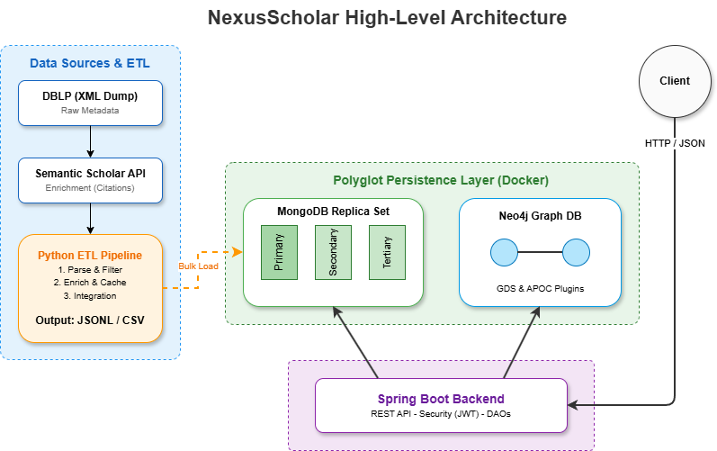

# NexusScholar: Research Paper Analytics and Collaboration Network

**University of Pisa**
- **Course:** Large Scale and Multi-Structured Data Bases
- **Academic Year:** 2025-2026
- **Instructors:** Pietro Ducange, Alessio Schiavo
- **Team:** Daniele Congiusti, Andrea Covelli, Luca Giannini

[](https://github.com/AndreaCovelli/NexusScholar/actions/workflows/backend-ci.yml)
[](https://codecov.io/github/AndreaCovelli/NexusScholar)
[](https://sonarcloud.io/summary/new_code?id=AndreaCovelli_NexusScholar)

---

## 1. Introduction (Storytelling)

NexusScholar is a platform designed to help researchers, students, and R&D departments navigate the vast landscape of scientific literature. While platforms like Google Scholar help you *find* papers, NexusScholar helps you *understand the connections*. It reveals the most influential authors in a specific field, tracks how scientific ideas evolve through citation networks, and identifies hidden collaboration pathways between institutions.

## 2. Architecture Overview

The system implements a Polyglot Persistence architecture, utilizing the right database for the right data structure.



- **MongoDB (Document DB):** Stores rich content (papers, author profiles). Configured as a replica set for high availability and read scaling.
- **Neo4j (Graph DB):** Manages complex relationships (citations, co-authorship) for network analysis.
- **Spring Boot Backend:** Provides business logic, data orchestration, and RESTful APIs.

### Technology Stack
- **Backend:** Java 25 (LTS), Spring Boot 3.x
- **Databases:** MongoDB, Neo4j
- **Infrastructure:** Docker, Docker Compose
- **CI/CD:** GitHub Actions, SonarCloud, Codecov, JUnit, Testcontainers

## 3. Local Setup Guide

The project is containerized for easy setup.

### Prerequisites
*   Docker and Docker Compose installed.

### Running the Application
1.  **Clone the repository:**
    ```bash
    git clone [https://github.com/AndreaCovelli/NexusScholar.git](https://github.com/AndreaCovelli/NexusScholar.git)
    cd NexusScholar
    ```
2.  **Configure Environment Variables:**
    Create a `.env` file in the root directory by copying `.env.example`.
    ```bash
    cp .env.example .env
    ```
3.  **Start the Services:**
    ```bash
    docker compose --env-file .env -f deployment/docker-compose.local.yml up -d
    ```
4.  **Initialize the MongoDB Replica Set:**
    (Required only on the first run). Run the initialization script to configure the MongoDB containers into a replica set.
    ```bash
    bash deployment/scripts/init-mongo-replica.sh
    ```

## 4. API Access

Once the application is running, the RESTful API documentation is available via Swagger UI:

[http://localhost:8080/swagger-ui.html](http://localhost:8080/swagger-ui.html)

A Postman collection is available at: `experiments/NexusScholar.postman_collection.json`.

## 5. Documentation Index

The complete project documentation is located in the `/docs` folder:

*   [01 Analysis (Idea, Requirements, UML)](docs/01-Analysis/README.md)
*   [02 Architecture (DB Design, Queries, Distribution)](docs/02-Architecture/README.md)
*   [03 Implementation (Code Structure, API, CAP Analysis)](docs/03-Implementation/README.md)
*   [04 Testing and Validation](docs/04-Testing/README.md)
